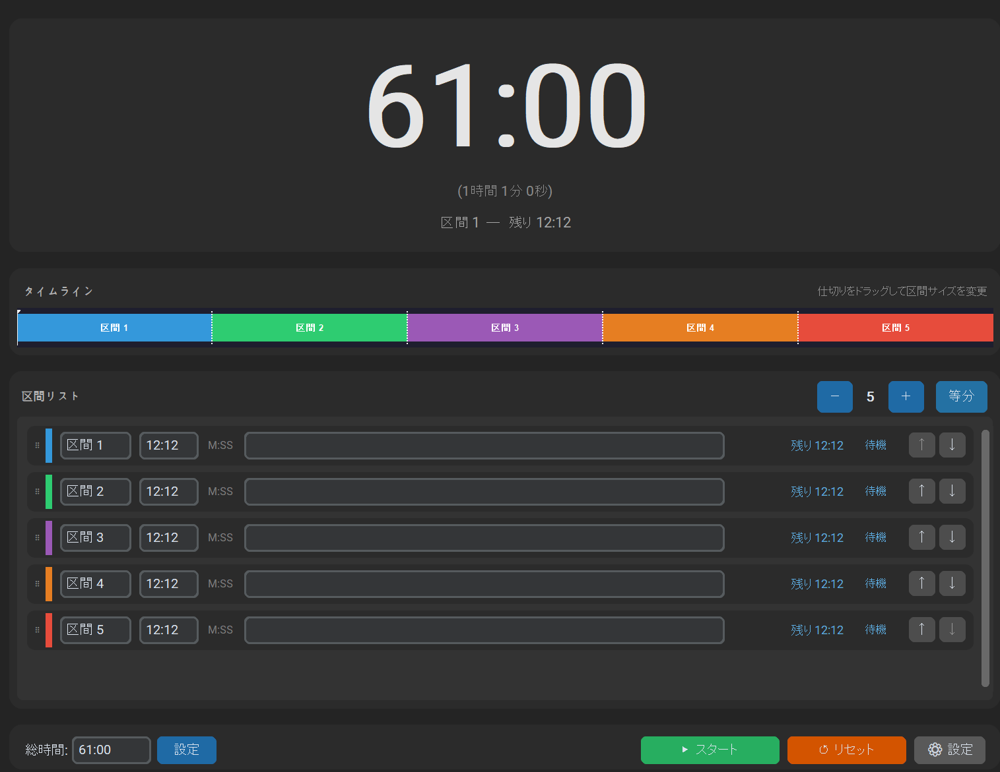

# MinutetimeLine

Python + customtkinter 製のデスクトップタイマーアプリです。時間を「総分数:秒」形式で表示し、複数の区間（セグメント）をタイムラインバーで視覚的に管理できます。日本語 / 英語に対応しています。

**▶ [最新版（MinutetimeLine.exe）をダウンロード](https://github.com/Haruyasu-T/MinutetimeLine/releases/latest)** — Python のインストール不要、ダウンロードしてダブルクリックするだけ。



## 主な機能

| 機能 | 説明 |
|------|------|
| 時間表示 | `120:05` のように「総分数:秒」形式でカウントダウン（カウントアップ表示にも切替可） |
| タイムライン | 区間をカラフルなバーで視覚表示。経過済み部分はダーク表示 |
| 区間管理 | 名前・時間・色・メモを設定して区間を追加・削除。ドラッグで並べ替え |
| 区間ごとの残り時間 | 各区間の残り分:秒を個別表示（待機 / 進行中 / 完了） |
| タイマー制御 | スタート / 一時停止 / 再開 / リセット。区間スキップ（前後） |
| 警告しきい値 | 残り時間が指定秒数を切ると色・音で警告（複数設定可） |
| 繰り返し | ループ再生。繰り返し回数の上限指定（0 = 無限）も可能 |
| プリセット | 設定一式を保存・読み込み。完了後に別プリセットへ連結も可能 |
| 実績ログ | 完了した区間を記録し、一覧表示 |
| カスタム音 | 完了音に任意の WAV ファイルを指定可能 |
| タスクトレイ | 閉じる時にトレイへ最小化して常駐 |
| 予約スタート | 指定時刻に自動で開始（アラーム的に使用可） |
| 表示モード | コンパクト表示 / 円形表示 / 外観テーマ（自動・ライト・ダーク）の切替 |

## 使い方（Python が無くてもOK）

Python をインストールしていない人は、**単体実行ファイル（.exe）** をダウンロードして
ダブルクリックするだけで使えます。

1. [リリースページ](https://github.com/Haruyasu-T/MinutetimeLine/releases/latest) から `MinutetimeLine.exe` をダウンロード
2. 好きなフォルダに置いてダブルクリックで起動
3. 設定・プリセット・実績は exe と同じフォルダに自動保存されます

> ⚠️ 署名なしの実行ファイルのため、初回起動時に Windows SmartScreen の警告
> （「WindowsによってPCが保護されました」）が出ることがあります。
> 「詳細情報」→「実行」で起動できます。

## 開発者向け：Python から実行する

```bash
pip install -r requirements.txt
python timer.py
```

依存ライブラリ: `customtkinter`, `pystray`, `Pillow`
（`winsound` は Windows 標準のため追加不要）

## 開発者向け：.exe をビルドする

```bash
pip install pyinstaller
build_exe.bat
```

`dist\MinutetimeLine.exe` が生成されます。

## キーボードショートカット

| キー | 動作 |
|------|------|
| `Space` | スタート / 一時停止 |
| `N` | 次の区間へスキップ |
| `P` / `B` | 前の区間へスキップ |

※ ショートカットはウィンドウにフォーカスがある時に有効です。

## 使い方

1. **総時間を設定** — 「総時間:」欄に `61:00`（総分数:秒）のように入力して「設定」をクリック
2. **区間を構成** — 「区間リスト」の `＋` / `−` で区間数を増減、「等分」で総時間を均等割り。各区間の名前・時間・色はリストで編集できます
   - タイムラインの仕切りをドラッグすると、区間の長さを直感的に調整できます
   - 時間の入力欄はマウスホイールで ±1分 / ±1秒（Shift で ×10）調整できます
3. **スタート** — ▶ スタートボタンでカウントダウン開始
4. **一時停止 / 再開** — 実行中に同ボタン（または `Space`）で切り替え
5. **リセット** — ↺ リセットで最初に戻る

## 動作環境

- Python 3.9 以上
- Windows（音・トレイ機能はWindowsのAPIを利用）
  - macOS / Linux でも基本的なタイマー機能は動作します

## 設定ファイル

実行時に以下のファイルがスクリプトと同じフォルダに生成されます（リポジトリには含まれません）。

- `timer_settings.json` — 現在の設定
- `timer_presets.json` — 保存したプリセット
- `timer_stats.json` — 実績ログ

## 開発経緯

勉強や試験対策の時間管理に一般的なタイマーを使っていると、時間を区切って配分したいときに分割がしにくく、時間配分を考えるたびに少し手間がかかっていました。「最初から区間に分けて、配分を視覚的に組み立てられるタイマーがあればいいのに」という思いから、このアプリの制作を始めました。

時間を「総分数:秒」で表示しているのも、その狙いからです。分を時間に繰り上げず（61分なら `1:01:00` ではなく `61:00`）、全体を分で表すことで、全体を何分割するか・各区間を何分にするかといった **等分やタスク分割を直感的に考えられる** のが一番の特徴です。

また、本格的なアプリ開発はこれが初めての挑戦でした。「まずは何か形にしてみよう」と思ったとき、いきなり複雑なものではなく、**仕組みはシンプルながら自由度が高く、思い通りのものを作れる** という理由でこのデスクトップタイマーを選びました。Python + customtkinter で少しずつ機能を足していき、最終的には Python の無い環境でもダブルクリックで使える単体 exe として公開するところまで辿り着きました。
